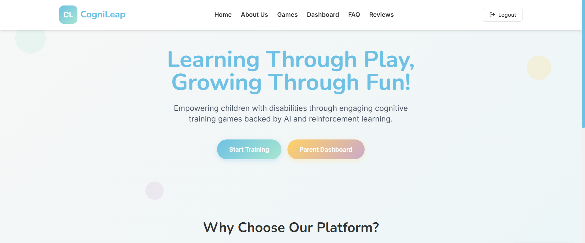
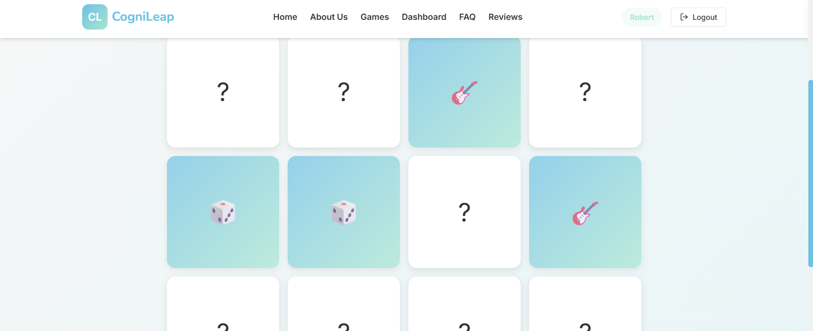
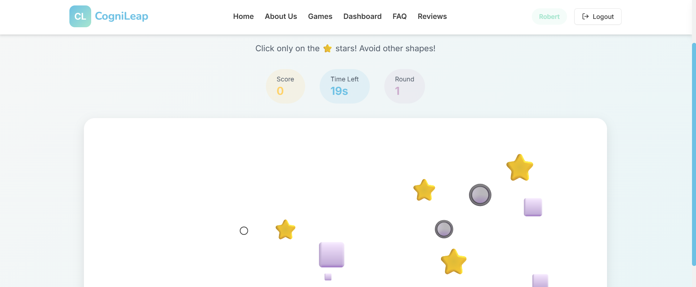
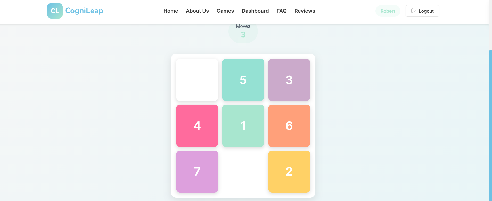
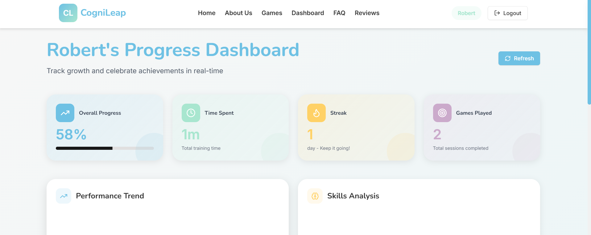

# Cognileap

Cognileap is a full-stack web application designed to support cognitive skill development in children through structured, game-based activities. The platform focuses on improving memory, attention, logical thinking, and response time, while enabling caregivers to monitor progress over time.

---

## Features

- Cognitive training games for memory, attention, and logic
- Structured and guided learning activities
- Performance tracking for individual users
- Caregiver/parent monitoring interface
- Simple and responsive user interface

---

## Tech Stack

### Frontend
- React
- JavaScript
- HTML, CSS
- Yarn, Node.js

### Backend
- Python
- FastAPI
- RESTful APIs

---

## Project Structure

cognileap/
├── frontend/ # React frontend application
├── backend/ # FastAPI backend server
├── tests/ # Test cases
├── .gitignore
├── yarn.lock
└── README.md


---

## Setup Instructions

### Backend

```bash
cd backend
pip install -r requirements.txt
uvicorn server:app --reload

## Screenshots

### Home Page


### Memory Game


### Attention Game


### Puzzle Game


### Dashboard

